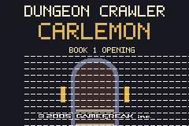
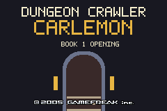
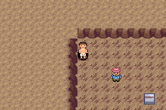
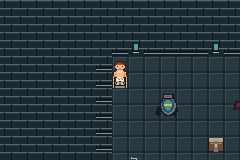
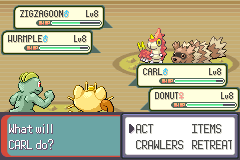
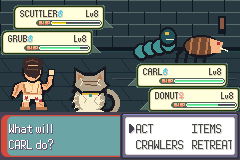
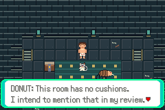
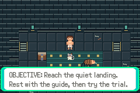
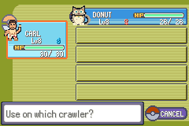

# S02 runtime evidence — VISUAL ACCEPTANCE FAILED / UNMERGED

The user rejected current protagonist sprite quality. **Do not treat this package
as S02 completion or merge approval.** Parent is preparing replacement art outside
the repository; the sole implementation writer will integrate it. See the
[replacement contract](../../s02-art-handoff.md). S03 remains dependent.

Base `abf9875af2ffead2a342b8a5835c1e3dff157ec0` (S01 merge).
Tested source `a242983b6f6d061dd2c5bd4916c34f8b1fd10266`.
Production SHA256 `26ef6bff3466499592b994de02293efe338362b79fb9da69a55039206ad0b921`.
Implemented prototype; isolated compilation PASS;128 runtime assertions PASS;
visual acceptance FAIL; merged NO. Issue26; draft PR reference in progress log.

`bash scripts/test-s02.sh` uses the toolchain environment in [testing](../../testing.md),
archives the exact commit, regenerates game/compiler products, builds the host
with `-Wall -Wextra -Werror`, and drives real mGBA0.10.5 through normal buttons.
No fixture ROM, RAM writes or savestate injection. Six processes have empty error
logs.31 final actual PNGs were visually reviewed;3 earlier actual captures provide
before comparisons. SHA256SUMS covers56 files:5 routes,12 runtime logs,5 build/
metadata files and34 PNGs. The gates route is the unchanged S01 route, linked below.

| Route | Assertions | Verified scope |
| --- | ---: | --- |
| title |1| Real title renders with fixed affine blank tile; fresh flag unchanged |
| setup |32| Fresh intro/exploration, one-time supply reward, normal manual save |
| ui |13| Donut scene, Journal objective/rules/optional text, return to movement, roster/summary boundary, medicine UI |
| trial |31| Both act; normal win/XP/resources, workshop reward, medicine use, repeat states and manual save |
| rest |34| Cold depletion/reward persistence, re-entry/repeats, guide restoration/save |
| [gates](../s01/gates.route) |17| Service/gauntlet/gate navigation, locked boss/stairs, return/save |

Asset check (Python3/Pillow12.3.0) verifies49 indexed images, seven sprite dimension
contracts,4bpp and tile budgets, transparent title tile0, and11 used metatile
behavior matches. Collision/elevation bits also compared against S01 across all12
map/border binaries and match. Replacement art will need these checks rerun.

Presentation/object changes shifted the deterministic input replay's damage/XP
phases. The updated trial route records actual outcomes instead of retaining old
frame assumptions: after win Carl9 XP495 HP22 resources4/40; Donut9 XP805 HP19,
resources0/38; medicine restores Donut28, consumes exactly1. Cold reload preserves
state and guide restores33/28,8/40,2/40. Battle rules/stats were not changed by S02.
The original R02 exact damage golden does not pass unchanged; full fresh/branch
combat regression remains S03. The scoped31 assertions do not substitute for that.

Visual defects fixed before this run: title letter pixels leaked into repeated
blank affine tile0; a redundant summary heading clipped. Actual before/after title
captures verify the fix. Small shading/fur refinements and stone seams replaced
oval pads, but the user still rejected the character-art direction. Do not equate
original provenance with acceptable visual quality.

Before title (tested5fd9217):

After (testeda242983):

Same gauntlet entry before (tested2e8de08):

After (testeda242983):

Same trial first-turn view before (tested2e8de08):

Current rejected prototype (testeda242983):

Still inherited: menu frames/bag/summary backgrounds and some baked labels,
boot/copyright credits, ball send-out/summary marker, music/sounds/move animations.
Original NPCs remain stationary; rooms are sparse/repetitive. These limits need
honest review and focused polish after progression blockers. No public playable
release, no20–30-minute human pacing claim, no S03 or Stage6 completion claim.
