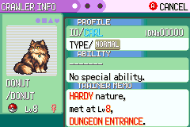
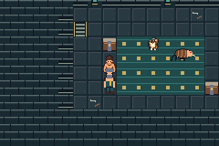

# S03 interim visual review — not final acceptance

Actual production ROM tested source c9062dabb81341bf0525eead8d89ea7ba62043f5,
SHA256 7a0a87273a6b53bd9104afa2029fd99fe6cee93d30f56dc01881b6adbdcb7b72.
This is the same engine source merged in S02 d8f8ae6. S03's full committed-snapshot
acceptance run remains pending; these are interim captures, not generated art.

Walking:380 consecutive real mGBA framebuffers,59.7275Hz (6.362 seconds), captured
through normal input. GIF keeps every second frame with6.360s total duration,
46 original colors, no interpolation or speedup. Input route and source-frame
hashes/duration metadata are included. Reproduce conversion with
`python3 scripts/render-walk.py <capture-directory> walking.gif`.
The source movement run passed9 assertions with empty errors; Donut UI run passed16.
Actual action selector is `donut-menu.ppm` from S02 trial; the older image named
`donut-actions` was mid-SPARK and did not show the selector.

This short motion recording is not a measured20–30minute fresh-player playthrough.
Pacing and complete S03 gameplay regression remain separate acceptance work.
