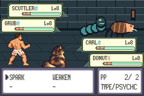
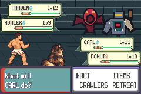
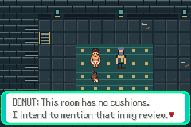
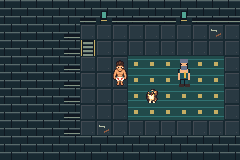

# S03 full-slice validation

Base: `d8f8ae62a3fba0dbe4c2c17fa2a4a1ce193bc530` (S02 merged).
Tested source: `50435d1c7db1e6778ad71e639e7a1a8ff4175653`.
Production SHA256: `7a0a87273a6b53bd9104afa2029fd99fe6cee93d30f56dc01881b6adbdcb7b72`.
The production game is byte-identical to S02's c9062da build. S03 changes host
validation, current input routes and documentation, not gameplay or save layout.

Run `bash scripts/test-s03.sh` using [the toolchain instructions](../../testing.md).
The runner builds a clean git archive, regenerates compiler/game products and
compiles its mGBA0.10.5 host with `-Wall -Wextra -Werror`. Its source/head guard
rejects concurrent tracked edits. All captures are actual240×160 framebuffers.
Integration status is recorded in [progress](../../progress.md), PR30 and issue29.

## Coverage and evidence

**PASS: clean build,1,053 runtime assertions in62 sessions,62 empty error logs,
unchanged-source guard and scoped visual review.** The acceptance summary separates860 production and193
explicitly labeled diagnostic-fixture checks. Each successful session has an
empty errors.log. Full raw setup/build/emulator logs and all62 input routes are
included. Fixture checks are separate compiled ROMs used only for difficult
capacity/depletion states; their hashes and build logs are labeled. No fixture is
a playable deliverable. No ROM/save/executable is committed.

- Fresh tutorial to staircase, guide, every map transition and both Donut scenes.
- Restored61-check trial: four battlers, damage/PP, rejected empty SPARK without
  lost turn/resources, WEAKEN effects, XP/stats and pre-workshop reward state.
- Guard/Howler and prepared/unprepared boss victories; locked stair progression;
  each encounter's local defeat/free recovery and cold saved retry.
  Six retry routes end after battle re-entry; separate routes prove victory,
  not a win in that exact recovered-save attempt.
- Both incapacitation orders: surviving partner still acts, then both defeat.
- Declined and completed quest paths, avoided and triggered trap, secret,
  repeat rewards/crafting/cache, medicine, atomic capacity failures and reload.
- Equipment held across cold reload; collection bag/battle paths and engine guards.
- Explicit exhaustion fixture: nonlethal trap at1HP preserves existing poison;
  both protagonists have all PP empty, real STRUGGLE finishes battle, depleted
  save reloads and free guide recovery restores resources/status.
- Actual Donut summary/action selector, hardware palette reads and walking motion.

The battle pilot reads real menu callbacks/state and supplies ordinary controller
inputs; it never writes RAM, injects saves, skips turns or changes outcomes.
Separate outcome/flag/XP assertions decide success. Normal flash saves are copied
only to branch independent scenarios. Defensive uses two BRACE/three WEAKEN turns;
fortify uses three of each; offensive attacks until SPARK empties, then WEAKEN.
These are replay strategies, not game AI or player assistance.

## Continuous timing

`pacing.json` records one uninterrupted fresh prepared route, including quest
decline, avoiding the trap, all required fights, ordinary preparation backtracking,
staircase completion and final manual save. The next process cold-loads that save.
The route took90,586 frames /25m16.655s:53,700 fixed zero-input frames,
4,951 scripted button frames and31,935 dynamic battle-pilot frames. Startup2,044
frames is included, not added again. There are no mid-route reboots or savestates.
Frames are converted at59.7275Hz;
fixed waits, startup, button-held frames and dynamic battle-pilot frames are
reported separately. **This does not establish a novice's20–30minute playtime**:
reading, exploration and decision time need a human playtest. Do not add separate
cold-save process time to the uninterrupted measurement.

Two earlier unprepared continuous attempts lost at the boss; raw diagnostic logs
are retained, not counted as completion timing. The isolated unprepared strategy
passes; optional preparation is not a required progression flag. A fixed strategy
is not guaranteed across damage/targeting variation. Retry remains free and tested.

## Review limits and next improvement

Approved Carl/Donut native appearance and readable movement are present. Donut is
stationary, and battle/intro animation frames duplicate static poses. Inherited
boot/copyright/press-start glyphs, ball send-out/summary markers, audio/attack
animations, menu/bag/summary frames and some baked labels/type/ability/nature terms
remain explicit limitations; see [the content ledger](../../content-ledger.md).
This is an authored compressed Book1-opening adaptation with original dialogue,
not a chronology-faithful recreation or later-book content.

The user requested improved opponent art. That is the next focused improvement
for the existing SCUTTLER/GRUB/GUARD/HOWLER/WARDEN, with no additional enemies or
mechanics. The baseline captures here intentionally show their first-pass art.
An asset-only candidate does not count as integrated/runtime-verified work.
Await the user's playtest after scoped improvements, before any Stage6 expansion.

`capture-index.json` identifies each screenshot route and raw frame hash.
`walking.gif` is the actual recorded movement sequence, with frame hashes/timing
from the renderer. `SHA256SUMS` covers this directory except itself. Diagnostic
failures live under `diagnostics/`, apart from the successful acceptance logs.
