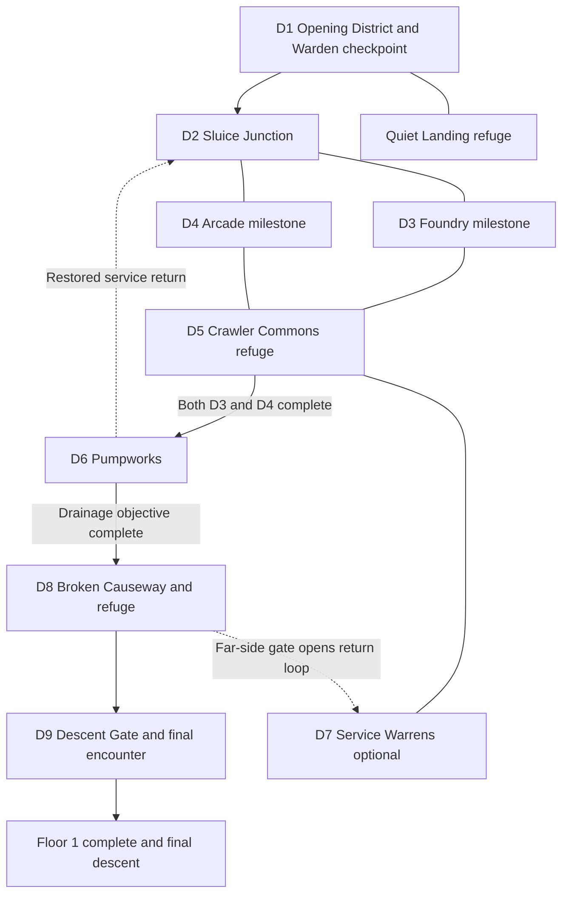
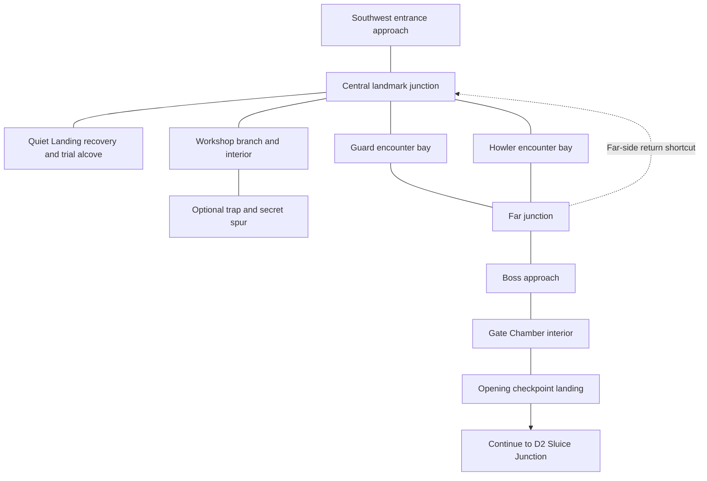

Assessment date: 7 October 2026, Brisbane.

The second iteration now plans a **full authored Floor 1**, roughly ten times the explorable area of the initial opening-sector concept. Nine connected districts provide a main route, optional discoveries, looping shortcuts and clear refuge connections. The earlier sector becomes the opening district and quality benchmark. Substantially better visuals, animation and Carl–Donut combat decisions remain central to the expansion. The revised navigation target gives the floor broad main paths, comfortable side routes and selective open junctions while retaining its landmarks and authored route choices.

**Implementation authorised and in progress.** Kurt authorised work on the full Floor 1 plan on 7 October 2026 at 13:42 Brisbane time, including continued implementation and builds through completion of the private review package. Public release remains a separate decision. Preserve the delivered six-room GBA slice and its evidence as a regression baseline. The full floor adds bounded original adaptation content within the existing Book 1 opening spoiler ceiling; approval of floor scale does not approve later story spoilers or establish book-accurate geography.

## Recommendation

Implementation is underway through these seven dependency-ordered work packages:

1. Preserve the pinned baseline, fix the two text inconsistencies and prove the opening district's visual and animation quality in the actual game.

2. Establish readable duo combat, fair prepared and unprepared routes, and a measured resource budget before increasing encounter count.

3. Graybox the nine-district floor graph, measure unique walkable area and prove camera, map connections, recovery travel and engine headroom.

4. Lock the bounded encounter, quest, reward and progression design, including legacy-save migration and a separate full-floor completion state.

5. Integrate districts incrementally with matching native art and animation.

6. Reconcile whole-floor presentation, interfaces and sound.

7. Complete human route playtests, regression checks and a private review package.

Preserve successful mechanics and recognisable character identities while improving weak shapes, shading, proportions and static poses. Additional space must create orientation, anticipation, branch choice or discovery. Longer empty corridors, inflated enemy health and repeated fights cannot justify it. The earlier 20–30 minute hypothesis applies only to the opening slice; full-floor duration must come from active human playtests rather than multiplying that number by ten.

## Full Floor 1 scope

### Scale that can be measured

“Roughly ten times larger” means **explorable walkable area**, not ten times the width and height. First graybox the proposed 64×48-metatile opening district and its small interiors. Let **T** be the number of unique collision-valid cells a player can reach across that district after its intended gates are opened, counting each cell once. Exclude solid walls, decorative void, inaccessible cells and duplicate map-edge buffers. Count optional reachable rooms and interiors consistently in both baseline and floor totals. Apply the path-width contract below to D1 before measuring T. If later width or geometry revisions change the accepted spatial baseline, record the before-and-after counts and update T and the full-floor comparison together; do not silently rebase the multiplier.

Aim for **about 10T**, with an initial design band of **8–12T** across the full floor including District 1. The 64×48 envelope contains 3,072 cells, but that is not 3,072 walkable cells; neither 30,720 walkable cells nor a 640×480 monolithic map is established. The existing six-room build is the gameplay regression baseline, while the reviewed opening-sector graybox supplies the spatial baseline. Record both so the comparison cannot drift. Count newly reachable widened cells once, but do not meet the area target by widening empty corridors or uniformly stretching the geometry. Keep the nine district purposes and bounded content meaningful; reshape unproductive space rather than adding filler.

### Path widths and navigation space

Use **16×16-pixel walkable metatiles** as the unit. Measure clear usable width after solid collision, wall edges, props, NPC occupancy and staged characters are accounted for; visual floor texture behind an obstacle does not count.

- **Main routes: 5–7 clear metatiles wide.** Use broad, readable connections between major district spaces; avoid long two-metatile corridors across the full floor.

- **Side routes: 3–4 clear metatiles wide.** Optional branches still need comfortable passage, readable turns and reachable interaction tiles.

- **Selected junctions: 8–12 clear metatiles across.** Open the places that need branching, landmark staging or an encounter approach. This is not a requirement to turn every junction into a giant plaza.

- **Short doors and deliberate chokepoints: 1–2 clear metatiles may be appropriate.** Keep each threshold brief, intentional, visibly passable and tested from both sides. A narrow doorway does not justify a long narrow connecting route.

Widen bottlenecks and adjust the connections between spaces rather than stretching every wall, room or route equally. Preserve the nine-district graph, landmark hierarchy, optional branches, persistent shortcuts, progression gates and quick recovery access. Broader paths must support navigation and choices without padding distance, encounter counts or empty floor area.

Graybox acceptance requires measured clear widths, exact collision, usable object-approach tiles and native 240×160 camera walkthroughs at ordinary speed. Check bends, branch reveals, thresholds, map seams, NPC staging and recovery routes in both directions and legal route orders. Generated overviews communicate the wider visual direction only; their apparent scale does not verify metatile counts or passability.

### Proposed district architecture

Use nine authored districts: eight on the required floor route and one optional exploration district. Start with the envelopes below, then reshape or split them after measuring camera flow, connected-map buffers, events and memory. They are layout budgets, not guaranteed map sizes or a requirement to occupy every cell. The area shares include each district's assigned interiors and sum to a working 10T.

| District | Starting field envelope | Walkable share | Identity and player purpose |
| --- | --- | --- | --- |
| D1 Opening District | 64×48 metatiles | 1.0T | Broken pillar, worn stone and warm Quiet Landing; preserves the complete opening lessons, workshop, patrols and Warden checkpoint |
| D2 Sluice Junction | 64×48 | 1.0T | Broken great wheel and damp blue-gray masonry; establishes the floor hub, paired route choice and a visible return-service gate |
| D3 Foundry Galleries | 72×48 | 1.2T | Copper iron and a cold furnace shell; mechanical preparation, a guarded brace assembly and one required route milestone |
| D4 Buried Arcade | 64×56 | 1.2T | Ruined shopfronts, violet sign fragments and shuttered bays; crawler clues, interrupted sightlines and the second required route milestone |
| D5 Crawler Commons | 56×48 | 0.9T | Collapsed fountain and organised warm shelter; middle-floor refuge, short recurring conversations and clear onward/optional choices |
| D6 Pumpworks | 72×56 | 1.3T | Teal pipes and a drained cistern; a readable environmental state change, a distinct encounter situation and a return service connection |
| D7 Service Warrens | 64×48 | 1.0T | Rusted storage and roots through masonry; optional salvage, secret routing and a later shortcut loop |
| D8 Broken Causeway | 72×48 | 1.3T | Pale fractured bridges over dark void; anticipation, final preparation and a small refuge at the approach |
| D9 Descent Gate | 64×48 | 1.1T | Monumental black arch and restrained gold warnings; a new floor-ending challenge and the actual descent boundary |

Treat district envelopes as separate map groups. Start by evaluating one field map per district; split large or costly districts into connected chunks where the pinned engine requires it. Select the final map count from measured limits rather than promising that nine envelopes equal nine loadable maps. Adjacent maps should preserve path alignment and landmark cues; deliberate doors are appropriate for refuges, workshops and arenas. Avoid a loading-style doorway at every ordinary junction.

Keep a modest **7–9 compact interiors across the whole floor**, including the opening interiors, refuges and final arena. Most start around 12×10 to 20×16 metatiles, with a final arena up to 24×20 only if combat staging benefits. The opening checkpoint landing can share its approach map. These are provisional envelopes, not new mandatory rooms. Interiors and field cells count together toward the area target without double counting.

### Main route and optional loops

1. **Arrival:** complete D1's existing trial, patrol and Warden requirements, then pass the clearly labelled opening checkpoint into D2.

2. **First fork:** D2 offers D3 Foundry and D4 Arcade in either order. Both district objectives are required before proceeding from D5 to D6. D5 refuge can be reached after either branch, so taking one route does not strand a depleted party.

3. **Middle route:** D5 leads to D6 once both milestones are recorded. D6's drainage objective opens the path to D8 and a persistent return-service passage to D2.

4. **Optional branch:** D7 is accessible from D5 and can be skipped completely. Its far gate only opens from the D8 side, creating D8 ↔ D7 ↔ D5 return travel after the main route has reached D8.

5. **Final approach:** D8 supplies recovery and preparation before D9. D9 contains a new floor-ending encounter and final descent; the D1 Warden is an early checkpoint boss.

Solid undirected links allow return travel; arrows mark progression relationships rather than automatic one-way doors. D3 and D4 are required branches in either order. D7, side quests, secrets and optional preparation remain optional. Once opened, both dotted shortcuts work in both directions and persist. Neither shortcut grants an objective flag or bypasses the locked side of a milestone.

### Full floor overview concept

The opening district is the smaller cluster at lower left; the larger composition explores district identity, landmarks and overall scale. This generated 1672×941 panorama is an illustrative concept, not a measured 10× tilemap or gameplay screenshot. The route graph above is authoritative: exact door connections, collision, water/furnace states and playable map boundaries still need graybox design. Decorative subdivisions do not set a room or encounter quota. Retain this earlier overview for overall orientation; its narrow connectors are superseded by the wider navigation contract. The district-generation section below now includes a two-district stitched pilot for review; the remaining district masters await that feedback.

### Refuge placement and session pacing

Use three recognisable recovery anchors: Quiet Landing in D1, Crawler Commons in D5 and a small Causeway refuge in D8. Each provides the established free recovery and clear save access without an optional quest, payment or consumable. Record the active refuge and a legal safe spawn; a defeat must not return the player across several cleared districts or reset cleared encounters.

Prototype natural **10–20 minute district or objective blocks** as a session-design hypothesis, with a clear goal and recovery opportunity. Do not guarantee a total duration yet. Measure active exploration, decisions, battles, dialogue, menus and retry travel separately in normal-speed human play. Some quiet hubs should be shorter than combat districts. The floor may be large without making every visit long.

Set actual recovery and retry walking ceilings in the graybox review, then enforce them per district. Preserve the opening comparison gates below. For later districts, place refuge access or a return shortcut before repeated long walks become necessary. Test both first arrival and depleted-resource retreat; no forced rematches or repeated corridor-clearing should be needed to recover.

### Bounded content proposal

These are initial production bounds for meaningful content, not quotas to fill the map. Lock encounter and reward counts only after the core combat and whole-route resource model work. Use fewer entries if they play better; if the area still feels empty, tighten the geography instead of adding repetitive fights.

| Content | Proposed floor-wide budget | Design boundary |
| --- | --- | --- |
| Authored encounter setups | 18–24 total, including all existing D1 encounters; about 12–16 main-route and 6–8 optional | Count each setup once. Every reuse changes enemy pairing, telegraph, preparation, spatial approach or a consequential choice |
| Enemy vocabulary | Existing three behaviour roles plus at most two new role variants | Establish readable counters and duo choices before new powers; no reskin-only inflation |
| Major challenges | Existing D1 Warden, one middle-floor environmental setpiece and one new D9 finale | The environmental setpiece need not be another boss battle; finale has fair prepared and unprepared approaches |
| Recurring named NPCs | 5–7 total, including the guide and two existing crawlers | Each has a motive and at least one state-aware return interaction; no extra party members |
| Optional quest chains | 3 total, including Mara | Short discovery-to-consequence chains, each skippable and reward-safe |
| Secrets or discoveries | 6–8 total, including the existing secret | Mix useful knowledge, alternate access, a character moment and bounded supplies |
| One-time achievements | 4–6 total, including the existing two | Reward distinct choices or milestones; concise AI acknowledgement, not repeated interruptions |
| Authored reward opportunities | 6–8 total, including existing boxes and relevant caches | Deterministic, award-once and resource-budgeted; existing rewards keep their ownership |
| Preparation and crafting | Existing recipe plus 2–3 useful optional Charge sinks across the floor | No extra crafting economy; all mandatory routes remain possible after spending or missing supplies |

Possible new original quest chains are a route runner's missing markers across Arcade and Foundry, and optional salvage for the Commons from the Warrens. Their rewards can be route information, a bounded supply choice or an equipment sidegrade using the existing slot. Basic refuge recovery and required progression must never depend on them. Confirm exact dialogue, item names and encounter compositions through the content ledger before implementation.

Give each district a distinct reason to exist: orientation in Sluice, preparation in Foundry, social clues in Arcade, recovery and consequences in Commons, an environmental change in Pumpworks, optional discovery in Warrens, anticipation in Causeway and culmination at Descent Gate. Use the same enemies only when the tactical situation changes. Cleared encounters stay cleared; no mandatory grind, random encounter padding or health inflation.

### Progression and save contract

The D1 trial, two patrol-clear states, Warden victory and old slice-complete state retain their original meaning. The expanded build explicitly presents that old ending as an opening checkpoint and adds a reachable next objective. A completed legacy slice save must not be labelled as a completed floor.

Propose distinct persistent milestones for Foundry, Arcade, Pumpworks, Causeway access, the D9 finale and **full Floor 1 completion**, plus unique IDs for new quests, rewards and shortcuts. Treat these as design states until mapped to audited free flags or versioned save fields. D5 → D6 requires both Foundry and Arcade milestones; D8 requires the Pumpworks route state; final descent requires the main milestones and D9 victory. Access checks must agree with the Journal and visible door states.

Use persistent objective state rather than consumable keys for mandatory gates. Validate inventory-full branches before any item consumption. Check each shortcut from both sides before and after its unlock, through retreat and cold reload. An optional quest, skipped reward, spent Charge or defeated optional enemy cannot satisfy or block a required district milestone.

Extend the relocation register with a supported save/layout version or other verified discriminator. Preserve legacy party, inventory, quests, one-time rewards and opening milestones; initialise genuinely new floor state without awarding it. Migrate old positions to legal D1 anchors, including the checkpoint landing. Back up test fixtures and obtain a save-policy decision before an incompatible change; no silent save reset or repurposing of the old completion flag.

### Minimum full floor and stretch scope

The minimum complete floor is the nine-district graph, its three refuge anchors, distinct required branch objectives, the optional Warrens loop, the second service shortcut, the preserved opening checkpoint and a new tested final descent. Include only the lower end of the content ranges when it supports the experience. Area remains an approximately 10× design aim subject to the 8–12T measurement band and play quality.

Stretch work may add a tenth small optional district, richer staged Donut reactions, one extra quest outcome or a narrowly feasible follower. It must fit the same floor-wide content and performance review rather than silently expanding the main route. A tenth district is not needed to call the core floor complete.

Retain the Book 1 opening spoiler ceiling. New district names, geography, NPCs, challenges and connective scenes are explicitly original adaptation proposals, not claims about canonical Floor 1. Wider Book 1 events, later books, another floor, race/class trees, permanent party additions and a sponsor economy remain outside this plan without a separate decision.

## Where the first iteration stands

The first iteration has delivered the technical and gameplay backbone of the original Stages 0–5: a pinned Emerald foundation, a reproducible GBA build, six connected spaces, permanent Carl and Donut duo battles, rewards and equipment, an explosive recipe, traps, optional content, a boss, recovery and a clear ending. Catching, storage and breeding remain outside the game.

The latest improvements also addressed protagonist and enemy art, visible dungeon detail, objective guidance, room state feedback and recovery testing. Kurt is happy with the first iteration and has specifically identified visuals and animation as needing further improvement. The second pass should deliver an obvious improvement in what the player sees and how the characters move, alongside the gameplay refinements.

### Evidence and limits

Start from delivered main 3f1c851, whose later changes integrate documentation and packaging. The accepted gameplay evidence is recorded against eaf073d. Preserve that distinction and identify the exact gameplay candidate tested in the next run. [Final acceptance evidence](https://github.com/12nuskek/DungeonCrawlerCarlemon/blob/3f1c851cce076b51cf4eb174925d9a2e41777a1f/docs/evidence/n05/final/README.md).

- Automated and emulator checks establish a strong baseline for exercised routes, persistence, rewards, recovery and visual states. Preserve that coverage and rerun checks affected by new changes.

- The reported validation totals cover 90 emulator sessions and 1,531 assertions. Human playtime, first-time comprehension and moment-to-moment enjoyment still need a recorded playthrough. The scripted 25m17s route includes roughly 15 minutes of fixed zero-input waiting, so its duration cannot settle the human pacing question. [Pacing accounting](https://github.com/12nuskek/DungeonCrawlerCarlemon/blob/3f1c851cce076b51cf4eb174925d9a2e41777a1f/docs/evidence/n05/final/pacing.json).

- A successful uninterrupted prepared route is established. The unprepared route has segmented win evidence; a complete uninterrupted unprepared run remains an open evidence item.

- Static or duplicated battle poses, stationary exploration appearances for Donut, remaining token-like assets, and inherited presentation are known limitations with different priorities. A follower was explicitly deferred in the original design and should remain optional unless it proves cheap and reliable.

- The existing Space records the original plan and handoff. Its pre-build status should not be mistaken for the current delivered state.

The existing content includes the guide and two other crawlers, two achievements, two authored boxes, the trap and secret, one recipe, and the required distinct enemy behaviours. Preserve these original minimums in District 1 and count them once within the proposed floor-wide budget. [Current content ledger](https://github.com/12nuskek/DungeonCrawlerCarlemon/blob/3f1c851cce076b51cf4eb174925d9a2e41777a1f/docs/content-ledger.md). The expansion should add meaningful authored situations, while testing how the existing content works together before copying its patterns.

## The main design gap

The original design promises a strange, inhabited dungeon where Carl and Donut improvise together, other crawlers have motives, preparation changes encounters, and the AI reacts to what happens. The next pass should strengthen the connections between those systems and give them a more expressive visual identity. Connected geography, purposeful room composition, material definition, character poses and motion should make the dungeon feel authored and inhabited at native GBA size.

For example, a crawler's request can point to an optional risk; completing it can alter a later line or object state; its reward can support a useful tactic; and the AI can acknowledge the player's choice. A short, coherent chain like this contributes more than several unrelated pickups or exposition screens.

Four questions should guide every change:

- Does the player know what they are trying to do and why?

- Can they tell what Carl and Donut contribute to the next decision?

- Does the route, junction or interior give them something meaningful to notice, choose or discover?

- Does the world visibly or verbally respond to the result?

## Priority and evidence rules

Separate four kinds of work in the next backlog:

| Kind | How to handle it |
| --- | --- |
| Reproduced defect | Record the exact route, build and observed failure. Fix progression, save or reward failures before integrating dependent changes; art direction and candidate preparation can proceed in parallel. |
| Known limitation | Describe the present compromise and its effect on play. Choose a bounded improvement rather than treating every deferred feature as mandatory. |
| Design hypothesis | State the player problem and compare before and after. Combat resource tuning and room pacing belong here until a playthrough establishes the problem. |
| Expansion idea | The full Floor 1 layout and bounded additional adaptation content are authorised for implementation. Wider spoilers, later floors and public release remain separate decisions. |

Existing passing recovery, reward, save and state-visual tests should be retained. Do not reopen a closed issue simply because it once appeared in the backlog. New test volume should follow changed risk and useful coverage.

## Concrete first fixes

Two small text and state inconsistencies are visible in the current source. Capture their current runtime behaviour, then correct them before adding new features:

- **Route tag Journal:** while Mara's quest is active, the Journal calls the destination a northeast service crate, although the current prop and NPC wording call it a tag bag. It also continues to say to find the tag after pickup until the quest is completed. Use the current location name before pickup and a clear return-to-Mara objective after pickup. Preserve the existing reward and quest flags. [Journal branching and text](https://github.com/12nuskek/DungeonCrawlerCarlemon/blob/3f1c851cce076b51cf4eb174925d9a2e41777a1f/engine/data/maps/DCC_Vestibule/scripts.inc#L207-L255), [tag bag and pickup state](https://github.com/12nuskek/DungeonCrawlerCarlemon/blob/3f1c851cce076b51cf4eb174925d9a2e41777a1f/engine/data/maps/DCC_Service/scripts.inc#L81-L115).

- **Spent trap sign:** the warning sign continues to describe a live wire after the trap has been spent, while the trap's art already changes correctly. Give the sign a resolved state that agrees with the visual and hazard state. [Warning and trap scripts](https://github.com/12nuskek/DungeonCrawlerCarlemon/blob/3f1c851cce076b51cf4eb174925d9a2e41777a1f/engine/data/maps/DCC_Service/scripts.inc#L13-L35).

Check both immediately, after map re-entry, and after save and cold reload. Journal tests should also preserve the find instruction when a full inventory prevents tag pickup, and the completed instruction without duplicated rewards after hand-in. These are source-confirmed inconsistencies awaiting focused runtime captures; there is no evidence here of a new reward, damage or persistence failure.

The Journal already handles the main objective and patrol order. A quick check currently also includes two rules pages and the optional-quest page. Improve access to the current objective and keep detailed rules available through a deliberate choice. Measure the number of button presses and time needed to find the next action before and after. This is a convenience improvement rather than a missing Journal system. [Current Journal sequence](https://github.com/12nuskek/DungeonCrawlerCarlemon/blob/3f1c851cce076b51cf4eb174925d9a2e41777a1f/engine/data/maps/DCC_Vestibule/scripts.inc#L180-L255).

## Opening and player comprehension

The opening needs to establish the situation, relationship and immediate goal while getting the player into control quickly. Keep original adaptation dialogue within the opening of Book 1 and record deliberate chronology compression.

Use a short sequence of playable lessons: move and inspect, understand the next destination, try a duo decision, recover, then choose whether to explore an optional risk. Teach each concept close to the moment it becomes useful. Avoid a large opening explanation of systems the player cannot use yet.

Clarify the information the player needs at three points:

- **On first entering:** who Carl and Donut are to one another, the immediate danger, and the next reachable objective.

- **After the safe room:** how to recover, save, prepare and return; which objective advances the main route; which content is optional.

- **Before the boss:** the visible threat, the value of preparation, and the availability of a fair attempt without the optional reward.

Use consistent names for the same item, action, location and objective across dialogue, menus and prompts. Keep useful guidance available after its first display through the existing guide and Journal. Refine their current information structure rather than adding another competing objective system.

Proposed player checks:

- After the opening, the player can state the immediate objective without consulting the readme.

- After leaving recovery, the player can explain how to heal and save and can find their way back.

- At each main-route junction, the next required action has an in-world cue.

- The player can distinguish mandatory progress from the optional quest, secret and preparation advantage.

- Dialogue remains readable at native GBA size, with no clipped text, ambiguous prompts or instructions contradicted by controls.

## Combat choices and feedback

Keep the Emerald double-battle structure and the small existing action set. First improve the decisions the player can make with those actions: the purpose of a support move, target selection, resource conservation, and the relationship between preparation and the boss.

### Carl and Donut should have distinct useful turns

The current action set is deliberately small:

| Character | Action | Current role and resource limit |
| --- | --- | --- |
| Carl | STRIKE | Single-target physical attack, power 40, 8 uses |
| Carl | BRACE | Raises Carl's defence by one stage, 40 uses |
| Donut | SPARK | Magic attack against both foes, power 50, 2 uses |
| Donut | WEAKEN | Lowers both foes' attack by one stage, 40 uses |

[Current action data](https://github.com/12nuskek/DungeonCrawlerCarlemon/blob/3f1c851cce076b51cf4eb174925d9a2e41777a1f/engine/src/data/battle_moves.h#L4618-L4689).

Free guide recovery restores health, status and action uses. Donut's two offensive uses create a specific question to test: does she run out of engaging choices before the next natural recovery point? Frequent recovery might be a sensible part of the short route, or it might create unwanted repetition. Start with clearer uses, target and support-state feedback. The playthrough should establish whether the resource budget needs changing. Record ineffective turns, recovery trips and the player's explanation, then change one variable at a time if needed.

Review the action and resource balance across a whole run, including resource use before the boss. For each action, record its intended use, cost, target, feedback and one encounter where a player has a reason to choose it. If a character often runs out of interesting choices, adjust the existing costs, replenishment or effects before adding more systems.

The key question is whether the player sees a meaningful choice. A support move is successful when its consequence is understandable and worth considering against damage, not merely when the effect technically executes.

Useful bounded changes could include a clearer skill description, a short reaction that confirms a debuff, a better resource budget, or a simple existing-rules interaction in which one protagonist's action improves the other's opportunity. Introduce any new combination only after confirming it fits the engine and the story period.

### Enemies need readable roles

Keep the existing three behaviours as the opening teaching vocabulary: immediate pressure, endurance and disruption. Distinguish threats through silhouettes, prompts and effects. Across Floor 1, propose only a small number of additional role variants after the core resource and support decisions work; new combinations must change targeting, preparation or response rather than merely raising levels.

The current Warden alternates WIND UP and SLAM and targets Carl while he remains active. Make that pattern clear enough to invite a deliberate response. Pair its existing threat text with a small, coherent animation, palette cue or sound where practical. A player should be able to explain what the warning meant and how their response changed the outcome. [Current enemy pattern selection](https://github.com/12nuskek/DungeonCrawlerCarlemon/blob/3f1c851cce076b51cf4eb174925d9a2e41777a1f/engine/src/battle_controller_opponent.c#L1571-L1601).

### Preparation should change the fight without becoming a hidden requirement

The existing Charge and supply-cache route already changes the boss encounter: its two enemy levels are 10 and 8 when prepared, versus 12 and 9 unprepared. The cache prompt already explains the weakening before spending, and the prepared boss introduction confirms the result. Preserve those cues and observe whether players understand and value them; reinforce them only if the playthrough shows confusion. Preserve the Charge as the existing preparation interaction unless a separately scoped change justifies a wider combat item. Preserve an achievable route for players who skip the optional advantage or spend resources differently. [Current encounter parties](https://github.com/12nuskek/DungeonCrawlerCarlemon/blob/3f1c851cce076b51cf4eb174925d9a2e41777a1f/engine/src/data/trainer_parties.h#L1-L36).

Acceptance evidence should include:

- One uninterrupted prepared route and one uninterrupted unprepared route from a fresh save using ordinary controls.

- Two reasonable boss responses with the action sequence and result recorded.

- At least one clearly understood support or debuff use, plus a useful contribution from each protagonist.

- Review of depleted resources, an incapacitated protagonist and defeat recovery after any related change.

- A turn log or short clip that shows what the player saw, selected and learned, alongside the relevant deterministic checks. If tuning changes outcome sensitivity, check more than one timing or RNG trajectory.

Do not promise that two seeded wins establish universal balance. Use controlled repeatable runs to investigate failures and human play to judge whether the rules are understandable and satisfying.

## Opening district design and regression baseline

District 1 preserves the delivered sequence Entrance → Quiet Landing ↔ Service Room → Supply Gauntlet → Gate Chamber → First Staircase as the opening checkpoint. Its 16×12-metatile rooms and existing scripts remain the reference build. Redistribute those beats across the connected 64×48 starting envelope and purposeful interiors; new content belongs mainly in the later districts. Keep the original slice-complete result intact in the archived baseline, then explicitly author the new continuation into District 2.

### Opening district scale and camera

Start the graybox with a **64×48-metatile bounding envelope** for District 1's shared field area, plus compact separate interiors. At 16×16 pixels per metatile this is a 1024×768-pixel world envelope. The 240×160 GBA viewport shows approximately 15×10 metatiles, or 30×20 underlying 8×8 graphic tiles. The larger envelope gives the camera room to reveal approaches, junctions and off-screen destinations; it does not require every cell to be walkable or filled with content. A 5–7-metatile clear width is 80–112 pixels, approximately one third to one half of the screen's 240-pixel width; its on-screen footprint changes with route orientation. Prove turning room, sightlines and the feel of these dimensions in the actual 240×160 camera rather than judging them from a zoomed-out panorama.

These are proposed working dimensions, not a hardware guarantee or a final generated layout. Shrink or reshape the envelope if the route works better. Validate map buffers, connections, events, scrolling, graphics and memory before committing to one map. If the measured budget requires linked scrolling chunks, keep continuous route geometry, landmark continuity and matching edge coordinates; use as few seams as practical and avoid a doorway-style fade at every junction. Reserve deliberate hard transitions for the safe hub, workshop and boss interior.

### Geography and route choices

- **Southwest entrance approach:** a short arrival sequence leads toward the central landmark. Give the player an early interaction and a sightline toward the next destination.

- **Central junction:** a broken circular stone pillar with a metal service marker anchors orientation. The approach, safe-room door, workshop branch and required route each have a distinct silhouette or material cue.

- **North-wall safe-hub door:** warm light marks Quiet Landing. Recovery is easy to find again from the junction and the return loop. Keep the existing duo trial in a clearly separated training alcove adjoining the recovery nook; preserve free exit and revisits.

- **East and southeast workshop branch:** a readable side path reaches the separate workshop interior. The existing crawler, recipe, equipment and quest interactions retain their purpose. The branch is an optional preparation route, not a new prerequisite.

- **Southeast trap and secret spur:** a visibly distinct optional risk branches off the workshop approach. Preserve the existing tag bag, trap warning, spent state and secret reward rather than adding another quest or loot chain.

- **Northeast encounter fork:** two encounter bays give the existing Guard and Howler distinct staging and approaches, then rejoin at a far junction. Both orders remain valid. Architecture and sightlines communicate the two threats without imposing a new sequence.

- **Return loop:** a passage from the far junction loops west and south to the central landmark. A simple far-side opening makes the shorter return route legible and persistent. Reaching or opening it does not grant a battle-clear flag, block a valid encounter order or bypass the boss prerequisites.

- **Upper-right Warden approach:** the far junction reveals the Gate Chamber threshold and the landing beyond. Keep the existing Warden in a deliberate interior. The First Staircase beat becomes the opening checkpoint and an explicitly adapted connection deeper into Floor 1; it must no longer display full-floor completion in the expanded build. The new floor exit belongs to District 9.

Keep the existing trial, guide, quest and encounter prerequisites attached to their District 1 beats. The Warden still requires the trial and both patrol-clear flags. A connected corridor does not waive those rules, and no optional branch becomes mandatory because the floor is larger. The separate floor-progress rules below determine access beyond this opening checkpoint.

### Opening district route graph

Solid links describe traversable relationships, not a forced order of play. The dotted return passage opens from the far junction; Guard-first and Howler-first routes must both work.

### Opening district concept studies

These initial 1536×1024 studies now describe **District 1 only**, approximately one tenth of the proposed full floor's explorable area. They establish a candidate shared art direction and local route composition, while the full-floor district graph establishes the larger scope. They are illustrative concepts, not runtime screenshots, exact collision layouts or proof of the native 240×160 camera. Retain these as style and composition references; their older narrow passages are superseded by the path-width contract and are not collision specifications.

**Opening district overview:** connected approaches, central landmark, purposeful doorways, encounter bays and a looping return route.

**Central junction close view:** the pillar anchors orientation, with a warm safe-hub entrance and visible routes onward.

**Workshop branch close view:** a recognisable service doorway, clustered props and continuing passages distinguish the optional preparation branch.

### Opening district route and recovery checks

Treat distance as a cost to measure, not a target to inflate. Log metatile steps and normal-speed active walking time for entry to the landmark, each branch, both patrol orders, the optional round trip, the pre-boss recovery round trip and the defeat retry. Separate walking from dialogue, battles, menus and idle time. Along those routes, record the narrowest clear width after walls, props, NPC occupancy and collision are applied. Test bends, doors, camera seams, object approaches and each short threshold from both directions; no apparently broad route may collapse into an accidental two-cell connector.

Every added stretch must provide a useful reveal, decision, encounter approach or state change. Begin with a graybox check that no main-route stretch goes more than roughly one viewport width without a useful visual cue; this is a review heuristic, not a rule to scatter filler props. At each real junction, show the next landmark or an intelligible directional cue. Shorten empty stretches rather than adding content to fill them.

Set recovery and backtracking ceilings from the baseline walk and the new graybox before art rollout. As provisional comparison gates, a cleared encounter-to-hub round trip and a defeated-boss retry should be no longer in active walking time than their baseline equivalents; the unlocked loop must measurably shorten the far-junction return. If that cannot be achieved, move the hub door or shorten the loop before changing resources or encounters. Record any justified exception for review rather than silently accepting extra travel.

### Existing beats in the new geography

| Existing space | Proposed destination of its beats | Preserved purpose |
| --- | --- | --- |
| Entrance | Southwest arrival approach and first landmark reveal | Carl and Donut introduction, movement, inspection and existing opening triggers |
| Quiet Landing | Separate safe interior off the central junction | Guide, recovery, save, orientation and the separate duo-trial alcove |
| Service Room | Workshop branch/interior plus optional trap and secret spur | Existing crawlers, tag quest, crafting, equipment, trap, secret and state feedback |
| Supply Gauntlet | Two connected encounter bays and their shared far junction | Existing patrols in either order, supply-cache preparation and cleared-state relief |
| Gate Chamber | Upper-right boss approach and separate boss interior | Existing prerequisites, preparation effect, boss, recovery return and victory gate |
| First Staircase | Opening checkpoint landing beyond the Warden gate | Preserve the old slice milestone, explicitly introduce continuation to District 2, and keep full-floor completion separate |

Retain each existing District 1 trigger and reward exactly once. Relocation does not change enemy counts, quest states or reward ownership inside the opening district. The trial remains beside Quiet Landing recovery and precedes patrols in the teaching sequence, while exit/revisit freedom remains intact. Do not introduce trial-based patrol locks. Add later district state under separate reviewed IDs.

### Entrance approach

**Purpose:** establish Carl and Donut, immediate stakes, movement and inspection.

Use the approach to reveal the central landmark, a clear route forward and a small relationship beat. Let the player interact early. Remove or shorten text that repeats information better demonstrated by the next action. The entrance should introduce the tone without explaining the whole game.

**Check:** a first-time player leaves knowing the immediate goal and basic controls.

### Quiet Landing safe interior

**Purpose:** make safety, recovery and orientation unmistakable.

Build a strong visual contrast with hostile spaces through a consistent safe-room palette, prop arrangement and sound. Keep the guide easy to locate and the warm doorway recognisable from the central junction and return loop. Preserve the existing one-page contextual repeat-recovery interaction. Review any new guide lines against that concise pattern. Separate the existing duo-trial alcove clearly from the guide's recovery nook so safety and the practice encounter are not confused. Preserve the trial flag, rewards and freedom to leave or revisit.

**Check:** the player recognises safety, can recover and save, and understands what to do next after returning from a failed attempt.

### Workshop branch and optional service spur

**Purpose:** connect another crawler's needs with optional exploration, the trap and secret, resources and preparation.

Stage the existing workbench and crawler interactions in the workshop interior, and the trap, tag bag and secret on the optional service spur. Strengthen the existing NPC motive and give its outcome a visible or conversational consequence. Make usable services, quest objects and ordinary scenery easy to distinguish. Explain a recipe or equipment benefit at the point of use.

**Check:** the optional interaction is understandable, can be skipped, and has a legible payoff. The tag bag, trap warning, spent-wire art and secret remain coherent after state changes. The main route remains available through all existing accepted, declined and completed states.

### Supply encounter bays

**Purpose:** apply exploration lessons under pressure and offer a readable risk or route choice.

Retain the current stationary patrol encounters but stage them in two connected bays with separate readable approaches. Guard-first and Howler-first must both remain valid; neither route may strand the player or accidentally set the other encounter's flags. Improve silhouettes, sightlines and approach cues so each threat has a distinct place. Preserve the floor rule that cleared encounters stay cleared. Place the existing supply-cache interaction where its preparation value is clear, without making it mandatory. The far junction offers the return loop and the boss approach.

**Check:** threat recognition and navigation rely on visible cues rather than hidden trigger knowledge. Both encounter orders, retreat before a fight, cleared-state re-entry and the shortcut after reload work. Opening the loop never satisfies the trial or either patrol requirement. Actual roaming patrols remain an optional new behaviour requiring collision, sequence, blocking and persistent-state checks; they are not needed for this milestone.

### Gate approach and boss interior

**Purpose:** combine duo decisions, preparation and a readable major threat.

Foreshadow the encounter from the far junction and boss approach, then use a deliberate threshold and short character response. Make the preparation state and commitment point clear. Keep warning, action and aftermath in the same visual language so the boss feels like the culmination of earlier lessons.

**Check:** players can explain the danger, identify a response and recognise the effect of preparation. The arena, shorter recovery return, trial plus both-patrol prerequisites and post-victory gate state remain correct.

### Opening checkpoint landing

**Purpose:** acknowledge completion of the opening challenge and make the transition to the wider floor clear.

Preserve a concise Carl and Donut beat and meaningful AI acknowledgement, then introduce the reachable Sluice Junction objective. Use original adaptation wording that explains this is progress within Floor 1. Reserve the final descent and floor-complete acknowledgement for District 9.

**Check:** a player and a migrated save cannot mistake the old slice ending for full-floor completion. The opening checkpoint persists without granting later milestones; the next objective and District 2 connection work after save and cold reload. Preserve the archived slice build's original ending for regression comparison.

## Personality and narrative integration

Differentiate the guide and existing crawlers by motive, tone and reaction before adding the few new recurring NPCs in the floor budget. Keep GBA conversations short. A changed line should reflect an outcome, a new need or changed access; repeat visits should not replay introductions. Use separate reviewed flags for new quest states.

Carl and Donut should react together at entry, meaningful branch choices, discoveries, the opening Warden checkpoint, one middle-floor reversal and the final descent. Each short exchange should earn its place through character or consequence. Use controlled staging across districts and interiors; a full follower remains optional.

The AI should interrupt selectively. Entrance commentary, achievement text and boss commentary can establish its personality; routine repetitions should be shortened or suppressed. Awards should clearly distinguish the joke, what was earned and why it matters.

Maintain the content ledger for each scene: trigger, prerequisites, variation after an outcome, intended character beat, spoiler limit and test route. Original adaptation text must not silently create new book-canon assumptions.

## Rewards and resource economy

Keep deterministic rewards, the existing one-slot equipment model and the single explosive recipe. Make the opening rewards useful and understandable, then budget additional floor rewards around exploration decisions and recovery intervals. Avoid new currencies or a second progression system.

The current chain already gives two Potions from one achievement box, two Scrap from the trial box, another two Scrap from Mara's quest, and a recipe costing two Scrap per Charge. The optional wrap boosts STRIKE through a 20% normal-attack input modifier; rounding and damage calculation mean this is not a guaranteed 20% increase in final damage. The cache consumes a Charge, awards a Super Potion and weakens the boss. [Reward and recipe scripts](https://github.com/12nuskek/DungeonCrawlerCarlemon/blob/3f1c851cce076b51cf4eb174925d9a2e41777a1f/engine/data/maps/DCC_Service/scripts.inc), [item effects](https://github.com/12nuskek/DungeonCrawlerCarlemon/blob/3f1c851cce076b51cf4eb174925d9a2e41777a1f/engine/src/data/items.h#L4540-L4587).

Trial and quest rewards can fund two Charges, but the slice currently has one cache sink. Repeat crafting is intentional and tested. The floor expansion can give an extra Charge a useful optional role, such as opening a supply alcove or weakening a later encounter. Design those sinks with the entire resource budget; mandatory progression must always have a no-consumable route, so spending a Charge earlier cannot create a soft lock.

Map each reward to a purpose: teaching an action, enabling optional preparation, creating a trade-off, or rewarding a discovered secret. Check that a player sees and understands the item before being asked to rely on it. Show successful crafting, equipped effects, consumption and resolved loot states consistently.

Record a simple whole-route resource budget for mandatory rewards, optional rewards, expected spending and available recovery. Compare prepared and unprepared paths. Optional rewards should improve choice or efficiency while leaving a fair main route, and free recovery should remain available without allowing a required interaction to soft-lock.

Retain award-once, inventory-capacity, failed-craft, map re-entry and cold-reload checks. Add tests only where the new change introduces a new path or risk. Do not introduce random loot, repeatable farming, extra currencies, multi-slot equipment or a broader crafting economy in this pass.

## Image generation art and animation

### Visual target and reference bible

Use image generation as an explicit production step for environments, props, character pose exploration and animation keyframes. The target is a cohesive, expressive GBA dungeon: readable material clusters, deliberate light and shadow, distinctive route and interior landmarks, and Carl and Donut whose silhouettes and acting remain clear on a 240×160 screen. The improvement must be visible in ordinary play, rather than confined to larger concept pictures.

Build a compact reference bible from the current native room and battle captures, approved Carl and Donut art, and the existing five opponent designs. Preserve character identity and the opening Book 1 spoiler boundary while improving drawing quality. The existing enemies and proposed additions are original adaptation designs; a new role needs an approved local design entry, not an invented claim about book canon. Record the shared view angle, character scale, outline treatment, highlight direction, palette roles and material examples. Include what to avoid as well as one finished reference for each asset class. [Current art and animation limitations](https://github.com/12nuskek/DungeonCrawlerCarlemon/blob/3f1c851cce076b51cf4eb174925d9a2e41777a1f/docs/content-ledger.md#L304-L323).

Use one shared material language across the floor: worn stone, metal fittings, restrained workshop clutter and clear path edges. Quiet Landing uses warmer, calmer light and organised props; the central pillar and service marker are recognisable navigation anchors; the Gate approach grows more imposing toward its threshold. District palettes and landmarks may differ, but keep scale, path edges and interaction language consistent. Keep paths and interaction areas quiet enough to read. Cluster supplies, supports, wear and stateful props around meaningful places, with space around routes and characters. Avoid filling every floor tile with noise or treating every object as equally important. Keep the full 5–7-cell main-route and 3–4-cell side-route clearances usable after decoration. Widen selected junctions to 8–12 clear metatiles across where branching or staging benefits; cluster props at the margins without blocking object approach tiles, sightlines or exits.

Use the nine-district overview to test the floor's visual hierarchy, then retain the opening-sector overview, camera-scale vignette and purposeful interior as District 1 studies. For each later district, generate a smaller matching brief around its landmark, material and player purpose. Existing room masters can guide palette, lighting and props; their isolated footprints do not constrain the floor. Select one reference bible and allow targeted correction passes before rollout. Concepts establish direction; only native integration and emulator captures prove playable geometry and animation.

### District generation and stitched proof

Generate the district artwork as separate, compatible images, then assemble a full-floor overview. Use the whole-floor panorama for orientation and visual hierarchy; it is not the sole production asset. **Prove two adjacent districts and their shared seam before generating the remaining district batch.**

- **One master layout:** retain the authoritative nine-district route graph and a district placement grid. Define each district's reviewed metatile envelope, landmark, route roles and shared-edge ports before generation. Do not let independent images invent extra progression links.

- **One scale and style:** use the same top-down viewpoint, character reference, zoom and declared pixels-per-16×16-metatile reference across all masters. Different district envelopes may need different image dimensions. Keep shared palette roles, lighting, wall silhouettes, path-edge language and landmark hierarchy consistent. Prompted scale is a reference; a generator does not guarantee exact tile geometry.

- **One connection register:** for every shared exit, record the district/map pair, edge and coordinate range, clear walkable width, elevation, travel direction and progression state. Match both sides; preserve the required main/side widths and locked-side behaviour.

- **Controlled seam overlap:** allow a small agreed art buffer beyond each shared edge to align masonry, floor textures, lighting and silhouettes. The buffer is for seam work, not extra gameplay. Trim or reconcile overlap during assembly; do not duplicate walkable cells, triggers, props, rewards or encounters.

- **Pilot acceptance:** inspect the two-district stitched proof at the common scale. Check continuous path width, edge alignment, landmark transitions, palette/light consistency and collision intent. Correct the seam and reusable brief before producing the other district masters; preserve source images, prompts, versions and the connection register.

Keep both the individual district masters and an assembled full-floor proof for review. The assembled image remains a generated concept, not an exact playable tilemap. Convert selected art into reusable native tiles, metatiles, props and state variants; integrate against the reviewed geometry. Only exact collision checks, map-transition tests and actual 240×160 camera walkthroughs can verify in-game scale, passability and object approaches.

#### Opening and Sluice district stitch pilot

**Generated concept pilot for review:** D2 Sluice Junction sits north of D1 Opening District. Two separately generated 1536×1024 masters are joined directly at 1:1, without retouching their art pixels; the outside arrows mark the seam. The complete labelled proof is 1664×2232. The central connecting floor aligns approximately and the main path footprint is broader, but the wall edges, tile rhythm and detail scale still need reconciliation.

This pilot has **not passed the seam or native-layout acceptance gate**. Tight maintenance-bay and stair connections remain in D1, and small bridge/service bottlenecks remain in D2. Review each against the main/side width contract rather than treating every narrow area as an approved exception. Generated structures are illustrative adaptation candidates, not additional canonical landmarks or approved progression links. Keep the other seven district masters pending feedback on this pilot; exact metatile scale, collision, object approaches, gates and the 240×160 camera still require native validation.

### Asset priorities and proposed scope

| Asset group | Image generation contribution | Native deliverable and priority |
| --- | --- | --- |
| Floor and district views | Two adjacent district masters and a stitched seam pilot first, then compatible masters for all nine districts and an assembled overview; retain opening and camera studies | Shared scale, edge-port register and seam continuity tied to the floor graph; keep concepts distinct from emulator captures |
| Environment materials and tiles | Modular stone, floor, wall, trim and lighting studies using the selected viewpoint | Prove the central junction, workshop approach and safe-door contrast; reuse a modular family with bounded district-specific accents across the floor |
| Props and state changes | Clear shape studies for workbench, tag bag, supply cache, signs, doors and existing hazard details | Readable native props with required live, spent, opened or collected states; use the reviewed graybox interaction footprints and test relocated triggers |
| Carl exploration | Consistent directional and walking pose references | Improve the existing nine 16×32 frames, including clean silhouettes and alternating foot contacts; retain the current directional mapping |
| Donut exploration | Standing, attention and reaction pose references | Improve the three existing 16×16 directions; propose a two or three frame staged reaction, without requiring a follower |
| Battle characters and enemies | Separate front and rear references where needed, action keyposes, expressive threat silhouettes | Prioritise Carl, Donut and Warden; review existing opponents and each chosen new role for style consistency and readable tactics |
| Effects and interface art | Restrained impact, spark, brace, debuff and frame or icon studies | Propose two to four effect frames per selected action, subject to runtime allocation; hand-finish icons and preserve legible engine-rendered text |
| Large illustrations | Optional mood or composition references | Supporting reference only; title art, portraits and decorative splash screens must not displace route, interior, sprite and animation work |

The existing nine Carl frames and three Donut directions are exporter contracts, not a requirement to keep their current pixels unchanged. Current battle art uses 64×64 canvases, with static or duplicated poses still present. All new frame counts above and below are proposed starting budgets. Check the relevant sprite templates, animation tables, palette slots, compressed asset sizes and peak on-screen allocation before committing to them. [Protagonist exporter](https://github.com/12nuskek/DungeonCrawlerCarlemon/blob/3f1c851cce076b51cf4eb174925d9a2e41777a1f/scripts/content/protagonist_art.py), [opponent exporter](https://github.com/12nuskek/DungeonCrawlerCarlemon/blob/3f1c851cce076b51cf4eb174925d9a2e41777a1f/scripts/content/opponent_art.py).

### Production pipeline

1. **Brief from actual references and the route graph.** Capture baseline states, specify the player-facing improvement and identify the assets to replace. Supply approved identities, native dimensions, camera scale, palette roles and state variants. First agree the graybox topology, interior doors, collision and interaction anchors; those intentionally replace the old room coordinates. Hold that reviewed geometry fixed during an art-only pass. Any later movement of a door, trigger or prop is a separately tested map change. Record clear walkable widths and any intentional short 1–2-cell thresholds with those anchors; width is measured after collision and occupancy, not between decorative outer wall edges.

2. **Generate district masters, stitched proofs, camera vignettes and modular sheets.** First prove two adjacent districts at a shared scale using the master placement grid and connection register, then generate the remaining district masters and assemble the full-floor proof. Follow the district generation contract above, keeping the same floor graph and reference bible. Use old room masters only for compatible material and palette references. Generate modular wall, floor, corner, prop and state studies rather than flattening the whole floor into a painting. Keep character proportions, orientation, light and pose progression consistent. Preserve selected masters, prompts, seam decisions and provenance. A stitched concept is neither an exact collision map nor evidence of a playable route; a pose sheet does not establish animation timing.

3. **Redraw and clean at native size.** Separate candidates into individual sprites or reusable tiles, simplify noisy details and deliberately redraw pixel clusters, outlines and silhouettes. Do not assume that shrinking an illustration makes good pixel art. Convert through a controlled indexed palette and inspect the final RGB555 appearance. For the existing 4bpp OBJ workflow, use 16 palette entries with index 0 reserved for transparency. Remove edge halos, unintended opaque backgrounds and stray pixels.

4. **Fit the existing graphics contracts.** Assemble environment art into 8×8 tiles and the engine's metatile structure, preserving behaviour and collision attributes. The current map contract provides 512 primary tiles and 512 secondary tiles; these are allocation limits, not unused capacity. Measure existing occupancy and reuse before adding art. Keep the current 32×32 allocation rule for cleared-opponent markers and check route-specific background, object, UI and effect palette/VRAM use. Larger world dimensions do not create extra graphics capacity; measure map-buffer and event costs separately from visible tile and object costs, including connected-map edges. [Current fieldmap limits](https://github.com/12nuskek/DungeonCrawlerCarlemon/blob/3f1c851cce076b51cf4eb174925d9a2e41777a1f/engine/include/fieldmap.h#L4-L13).

5. **Author the actual frame sequence.** Clean each frame against a common canvas, baseline and pivot. Keep head size, body volume, feet, costume details and palette indices stable. Define frame order, duration, anticipation, contact, recovery, looping and interruption behaviour. Match Carl's foot contacts to his movement cadence; prevent body jitter and foot sliding. Supply front and rear views as distinct drawings when required, rather than passing a duplicate pose off as a new view.

6. **Bind and integrate.** Connect cleaned frames to the correct graphics tables, animation commands and gameplay events. Verify the exporter produces those assets and cannot overwrite them with older generated art. Keep an asset manifest with the source reference, final path, dimensions, palette, frame count, playback binding and replacement/rollback point. Effects must confirm real outcomes and leave battle text, HP and targets visible.

7. **Review the game and refine.** Build the candidate and capture actual native-size emulator screenshots, short clips and frame sequences. Review normal-speed motion and the camera walk across junctions, bends, chunk edges, doors and return paths. Exercise menus, battle entry and return, safe recovery, each interior transition and cold reload. Check allocation and palette behaviour in the busiest scene. Correct native assets, geometry or binding before extending the style through the next district.

Keep four deliverable states distinct: **concept reference**, **native asset candidate**, **integrated sprite or tile**, and **runtime-verified capture or clip**. Label them in the asset manifest and review package. Attractive generated art cannot substitute for emulator evidence, and a still-image generator does not by itself deliver animation or video.

### Reusable generation briefs

**Floor and district environment brief:** “Use the nine-district floor graph for topology and the shared reference bible for style. Keep the complete earlier opening concept as District 1, a small part of the full floor. Show Sluice Junction splitting through Foundry Galleries and Buried Arcade into Crawler Commons, then Pumpworks, Broken Causeway and Descent Gate. Service Warrens is an optional branch whose far gate closes a return loop; a Pumpworks service passage returns to Sluice. Distinguish warm refuges, landmarks and district materials. Make main routes visibly broad, targeting 5–7 clear 16×16 walkable metatiles, side routes 3–4 and selected useful junctions 8–12 across. Keep that space clear of walls, props and NPCs; preserve landmark hierarchy, branches, shortcuts and encounter approach cues. Use narrow 1–2-cell thresholds only as brief deliberate doorways or chokepoints, never long skinny connectors across the floor. Widen bottlenecks and reconnect spaces deliberately rather than stretching every room or turning all junctions into giant plazas. Show a consistent character scale and quiet traversable floor; an overview cannot certify exact grid scale. Generate district masters at the same zoom and declared metatile-to-pixel reference, using the master placement grid, registered shared-edge exits and small non-gameplay art overlap. Prove one adjacent pair and its stitched seam before the remaining batch; preserve individual masters as well as the assembled overview. For native work, brief one district at a time against its reviewed metatile envelope, camera views and collision anchors. Generate modular walls, floors, corners and stateful props with coherent scale and light. No fake UI, unapproved lore or later-book elements. These are planning and native-cleanup references, not runtime screenshots or engine-ready tilemaps.”

**Carl and Donut poses:** “Use the supplied approved Carl and Donut references to retain their identity, clothing details and relative scale while improving silhouette and acting. Keep the selected view, camera, lighting and proportions fixed across every pose. Produce a clearly separated pose strip for [Carl walking / STRIKE / BRACE or Donut attention / SPARK / WEAKEN], showing [specified anticipation, action and recovery poses]. Keep a consistent baseline, pivot and margin; do not crop limbs or change accessories. No invented costume or later-book detail. The strip will be redrawn and aligned into native frames.”

**Warden warning and attack:** “Use the existing Warden adaptation design and current battle screenshot as references. Develop five consistent keyposes for idle, WIND UP anticipation, readable warning hold, SLAM contact and recovery. Preserve its identity, viewpoint, scale and light direction. Make the raised threat and impact silhouette legible at the existing 64×64 canvas size without covering the HUD. No new monster identity, powers, lore or later-book references. Separate poses for manual native cleanup; do not claim this sheet is a finished animation.”

Fill the bracketed action, pose list and reference choices from the asset manifest before generation. Use the same selected reference bible throughout the batch, with targeted edits to approved candidates rather than a fresh style for every asset.

### Authored animation and runtime proof

Start the battle proof with proposed keypose budgets of three for Carl's STRIKE and two for BRACE, three for Donut's SPARK and two for WEAKEN, and five for Warden idle, warning and SLAM. These are pose targets to validate against the current engine, not guaranteed additional frame capacity. Add in-betweens only where they visibly improve motion and fit the verified budget. Repeated static frames may provide a deliberate hold, but do not count as newly animated movement. The Warden warning must agree with its real WIND UP state and remain understandable when the player chooses a response; do not suggest a new reaction-time mechanic.

Use staged Donut reactions and brief controlled movement as the default improvement. A full Donut follower is a separate optional feasibility experiment. Its acceptance would include doorways, map transitions, narrow passages, scene staging and save/reload behaviour. If it demands broad movement changes, use stronger controlled Donut appearances and short reactions in this milestone instead.

The first integrated visual proof follows the graybox and camera walkthrough. It should contain the central landmark junction, the workshop approach and optional branch cue, the safe doorway with a small Quiet Landing contrast sample, Carl walking in every supported direction, one staged Donut reaction, and one Carl–Donut–Warden battle sequence. Compare equivalent gameplay states and camera scale with the baseline, since redesigned geometry cannot always share identical coordinates. Look for stronger material depth, focal points, expression and motion while preserving quick recovery and clear choices. Review this vertical slice before mass conversion or rollout into the later districts.

Reject a candidate for inconsistent view angle or scale; identity drift, malformed anatomy or changing costume details; blurred or anti-aliased edges and pillow shading; unrecognisable props; unstable palette colours or transparent edges; gait errors, foot sliding or flickering outlines; HUD overlap; misleading hazard states; or effects that linger and slow repeated turns. First judge silhouette and motion at native size, then inspect pixel structure at integer scaling. A beautiful large master does not excuse a poor native result.

Keep the intentional spatial redesign reviewable separately from art-only changes. Inventory every moved object, collision edge, warp, connection, spawn and coordinate-dependent test; geometry changes are core planned work, not an accidental consequence of illustration cleanup. Once the graybox anchors are approved, freeze them for each art batch or record a new map change with its progression, encounter and persistence cases. Preserve accepted live/spent trap, opened cache, cleared encounters and completion states.

### Interface

Audit every screen reachable on the full-floor route for inherited terminology and concepts. Prioritise labels and prompts the player sees repeatedly: actions, items, character status, recovery, save and completion. Preserve internal engine naming where changing it would create broad churn.

Choose the smallest coherent crawler-facing menus the current engine can support. Do not introduce a second combat, equipment or progression model to make the UI look more original. Check all affected strings, cursor states, disabled options and transitions at native resolution.

### Sound

Make a deliberate sound pass for safety, danger, interaction, reward, warning and victory. A small set of appropriate existing or provenance-cleared sounds can establish identity without committing to a complete soundtrack. Quiet Landing and Service currently share the same inherited music; a focused safe-versus-threat treatment is a bounded option. Test loop transitions, volume balance and frequent effects for fatigue. Keep threat and state information understandable with sound muted.

Use the supplied native PNGs and existing exporters where they fit the selected direction, and improve or replace weak candidates through the pipeline above. Larger generation masters are source references; packed tiles become deliverables only when integration needs them. This plan does not require a particular image-generation model, external service purchase or automatic animation capability.

## Spatial compatibility and regression

Before changing map data, create one relocation register covering every old map ID, dimensions, collision edge, object/event ID, trigger coordinate, warp ID and destination, connection edge, camera limit, player or NPC spawn, defeat/recovery destination and scripted movement. Include menu return, battle return, new-game start, Continue, cutscene entry and legacy debug/test spawns. Tie each old anchor to a named new zone or interior and its walkable coordinates. Existing inventory, quests, awards, crafting, trap, patrol and Warden flags keep their meaning. The old completion flag remains an opening-slice milestone; a separate reviewed flag records full-floor completion.

### Legacy save position mapping

Never load old map coordinates blindly into reshaped geometry. Plan a layout-version-aware migration or another explicit, verifiable legacy-save discriminator supported by the current save format. If that requires an incompatible representation, obtain a save-policy decision before implementation.

| Saved baseline location | Proposed safe destination |
| --- | --- |
| Entrance | Valid arrival anchor in the southwest approach, preserving opening progress |
| Quiet Landing | Guide-side recovery anchor or the matching neutral trial-alcove approach, preserving the trial state without automatically starting a battle |
| Service Room | Workshop entrance or reviewed service-spur anchor consistent with quest, trap and secret state |
| Supply Gauntlet | Reachable neutral edge of the matching encounter bay; preserve each patrol's cleared state independently |
| Gate Chamber | Valid pre-boss approach or neutral arena return anchor appropriate to boss and gate state |
| First Staircase | Valid opening-checkpoint landing with the old slice milestone preserved, District 2 reachable, and new floor completion unset |

The register must resolve actual old coordinates and state combinations, not just these map labels. Check destination bounds, collision, object overlap, facing, camera framing and legal reachability before spawning. Prefer the nearest valid mapped anchor; use the hub recovery anchor as a documented fallback only when it cannot bypass required progression. Do not award missing items, auto-complete encounters, consume preparation, reset quest flags or silently replay one-time scenes during migration. Confirm the result with save, power-off and cold reload.

### Preserve assertions while updating coordinates

Keep the accepted baseline evidence and the behaviour each test asserts. Update coordinate-dependent routes and screenshots through the relocation register; do not delete an assertion because its old walking script no longer reaches a moved prop. Retain original expected award counts, inventory-full behaviour, failed-craft handling, live/spent hazards, opened-cache state, cleared encounters, prepared/unprepared boss behaviour and completion checks.

Add targeted coverage for scrolling and connected-map seams, warp entry/exit pairs, object visibility at camera edges, both patrol orders, trial and both-patrol boss gating, optional content skipped/declined/accepted/completed, return-loop persistence, retreat, defeat recovery and old-save migration from every baseline map. Verify that the shortcut neither creates a hidden progression bypass nor makes an optional branch mandatory. Any invalid legacy location must recover to its documented legal anchor without a soft lock. Extend coverage to both D3/D4 orders, each new district objective, optional D7 skipped, all refuge anchors, both far-side return gates, final descent gating and new floor completion. Do not erase the opening completion assertion; distinguish it from the new floor-complete assertion. Add collision-level width checks along main and side routes, bends, door thresholds and connected-map seams. Every required object needs a reachable interaction-adjacent tile and a clear way back; props, NPCs, scripted staging and cleared encounter markers must not pinch the route. Exercise the wider geometry in both patrol orders and both D3/D4 orders, with optional skips, depleted-resource retreat, defeat recovery and cold reload.

Record final map dimensions and chunk count, map/event buffer use, ROM/RAM effects, scrolling behaviour and peak background/object/palette/VRAM use in the actual game. Reuse modular tiles; a larger world is not permission to exceed graphics or event limits. Check the intended hardware limits and emulator runtime before accepting the layout. Reduce or split geometry if necessary rather than claiming that a concept image proves hardware feasibility.

## Dependency ordered implementation plan

### Package 1 Baseline and opening quality proof

Pin the delivered main and record the exact gameplay candidate under test. Preserve the original six-room build, saves, assertions and screenshots. Record a normal-speed baseline playthrough with active time by beat, recovery travel, unclear objectives and resource use. Map old scripts, flags, objects and coordinates to D1. Graybox its 64×48 starting envelope and purposeful interiors, then measure T and prove both patrol orders, optional skips and the return loop.

Capture and fix the two source-confirmed text/state inconsistencies while preserving their branches. Build the reference bible and coherent floor/opening/camera/interior concepts in parallel. Once D1 route and coordinates pass, integrate the central junction, workshop and safe doorway proof, improved Carl walking, a staged Donut reaction and the Carl–Donut–Warden battle sequence. Review actual native captures and animation before broad production.

**Exit:** D1 orientation, recovery, patrol orders and Warden prerequisites work; the width-compliant T baseline, minimum clear route widths, walking/retry limits and initial hardware measurements are recorded. Main 5–7-cell and side 3–4-cell paths, selected wider junctions and every deliberate short threshold pass collision, object-approach and actual 240×160 camera checks. The visual proof is visibly stronger at native size and animation reads at normal speed. The baseline remains reproducible. Generated art cannot pass the runtime gate.

### Package 2 Duo combat and resource foundation

Depends on Package 1. Test current action usefulness, threat responses and resource exhaustion, then choose narrow improvements supported by evidence. Finish protagonist action and Warden telegraph frames. Prove uninterrupted prepared and unprepared opening routes. Model later encounters between refuge opportunities before committing to floor fight counts; reserve resource margin for ordinary mistakes and optional exploration.

**Exit:** Carl and Donut each have understandable useful choices, support or debuff use has a visible purpose, two reasonable boss responses work, and proposed resource changes have before-and-after evidence. Native playback and allocation checks pass. Increasing enemy health or forcing recovery walks cannot substitute for a meaningful combat decision.

### Package 3 Full floor graybox and technical feasibility

Depends on Packages 1–2. Graybox all nine district envelopes and compact interiors using the authoritative graph. Test D3-first and D4-first, early Commons access, the required both-milestone gate, D7 skipped and explored, both far-side shortcuts, all refuges and the final approach. Measure unique reachable walkable cells, main/optional route steps and retry travel; target the 8–12T band without filler. Select map splits using the pinned engine's actual connection, buffer, event and graphics limits. Apply the width contract before decoration: resolve bottlenecks and improve connections while preserving branch and landmark hierarchy. Review every narrow exception, exact collision edge, interaction approach and both-direction recovery route in native camera captures; do not trade readability for empty oversized plazas.

**Exit:** every district has a distinct landmark, purpose and readable camera reveal; all legal orders and retreat paths work without debug commands. Finalised map-group boundaries, collision/warp anchors, clear-width measurements, object approach tiles, native camera captures, measured area and memory/ROM/graphics headroom are recorded. The floor is still graybox, so revising a weak district is cheap. No claim of GBA feasibility relies on the concept panorama.

### Package 4 Content progression and save design

Depends on the floor graybox and combat/resource foundation. Lock the smallest useful encounter, NPC, quest, discovery and reward budget. Write each content entry's purpose, prerequisite, optional/required status, reward, state changes and test routes. Review new original adaptation writing against the opening spoiler ceiling. Map the floor milestones to audited flags or versioned fields; define D1 checkpoint continuity, a separate floor-completion state, refuge anchors and legacy migration.

**Exit:** no required gate consumes a scarce optional resource; no optional reward or quest is secretly required; reused fights have distinct tactical purposes. The Journal, doors and route milestones agree. New state IDs do not alias existing rewards or completion. Migration fixtures cover each old map and opening state, or an incompatible-save decision is obtained before dependent implementation.

### Package 5 Incremental district production

Depends on Packages 3–4 and the accepted opening visual proof. Integrate D2, the D3/D4 pair and D5 refuge first; prove that middle-floor loop before D6, D7 and D8; finish D9 last. Each small increment includes its scripts, content, collision, native tiles/props, required state variants and relevant character/enemy motion. Generate district reference and modular candidates through the existing pipeline, then clean and bind actual native assets. Keep an immediately playable checkpoint and rollback point.

**Exit for each district:** normal-speed navigation, encounter entry/return, optional skip, recovery and cold reload pass; moved anchors are traced; rewards remain award-once. Final art, props and NPC staging preserve the approved clear widths, reachable interaction tiles and deliberate short thresholds. Actual emulator screenshots and clips show readable materials, landmarks, interaction states and animation. Preserve the original assertion behaviours while remapping coordinates. A completed district should not leave an unfinished required system for a later art pass.

Review a playable increment before moving on. Packages 1–2 establish the reusable quality bar; Package 3 proves the floor's spatial and technical shape; Package 4 fixes content and persistence contracts; Package 5 extends the game district by district. Packages 6–7 below reconcile the whole experience and establish completion.

### Package 6 Whole floor presentation and tuning

Depends on the integrated core districts. Reconcile palettes, material transitions, interaction language, sound and menu objectives across the entire route. Tune encounter spacing and resource recovery from real play logs. Check the busiest scenes and connected-map edges for frame stability, object visibility, tile/palette allocation and recorded headroom. Preserve the current 32×32 cleared-opponent marker allocation rule.

**Exit:** the game has a coherent visual language with distinct district identities; menus, Journal, hazards and door states agree; actual native clips demonstrate stable animation and readable warnings. List every remaining placeholder or static compromise with its player impact. Concepts remain labelled separately from runtime evidence.

### Package 7 Human full route validation and private delivery

Depends on Packages 1–6. Complete normal-speed human-played routes from a fresh save through the actual D9 descent, including prepared and unprepared approaches, both D3/D4 orders and the original patrol orders. Cover optional-skipped and optional-completed paths across the route matrix. Exercise depleted resources, an incapacitated protagonist, defeat recovery, both shortcuts, inventory-full rewards, save/cold reload and every supported legacy-map migration. Scripted emulator tests supplement those runs; idle waits and debug shortcuts do not establish human pacing or a completed ordinary-control route.

**Exit:** final regression and content checks pass against the exact packaged candidate, and the tested route remains valid after packaging. Deliver privately with identity/checksum, controls, save compatibility, a short change summary, matched baseline/final screenshots, actual animation clips, measured area and playtime, remaining limitations and the next review decision. Stop at delivery and review unless further work is requested.

### Numbered dependency backlog

Relative risk describes likely integration complexity, not a time estimate.

| Order and priority | Task and dependency | Acceptance focus |
| --- | --- | --- |
| 1 Foundation | Pin the delivered base and preserve baseline evidence | Reproducible original slice, exact candidate, saved fixtures and old-to-new anchor inventory |
| 2 Foundation | Capture and fix Journal and spent-trap text; depends on 1 | Existing branches and rewards preserved through re-entry and cold reload |
| 3 Quality gate | Prove D1 geometry, art, animation and useful duo decisions; depends on 1–2 | Actual native captures, prepared/unprepared play, T and resource baseline |
| 4 Spatial gate | Graybox all districts; depends on 3 | Main 5–7-cell and side 3–4-cell clear widths, selected 8–12-cell junctions, native camera and exact collision/object approaches; both branch orders, optional D7, recovery/shortcuts, measured 8–12T and technical feasibility |
| 5 Content gate | Lock encounter and reward design; depends on 3–4 | Bounded meaningful content, distinct tactics, no grind or consumable progression lock |
| 6 Persistence gate | Specify and test new milestones and legacy migration; depends on 4–5 | Separate opening/floor completion, legal spawns, unique state IDs, explicit save policy |
| 7 Production | Integrate districts in small dependency-ordered groups; depends on 4–6 | Per-district script, collision, reward, art, animation and recovery regression |
| 8 Consistency | Reconcile interface, audio, palettes and transitions; depends on 7 | Coherent whole-floor presentation at native size and measured peak allocation |
| 9 Final gate | Human full-route review and exact-candidate regression; depends on 7–8 | Fresh and supported migrated saves, both branch orders, both combat approaches, optional skips and recovery |
| 10 Optional stretch | Follower or tenth optional district only after the core floor works | Clear player benefit and bounded implementation; cannot delay or redefine core completion |

Keep one implementation writer on the integration branch. Asset planning and read-only review may happen in parallel; shared engine changes should be sequential and reviewable. Each package needs its allowed files or systems, exclusions, acceptance evidence, rollback point and exact next task.

## How to judge the second iteration

Use this scorecard after the exact final candidate has been built. These are proposed acceptance checks, not claims that the expanded floor is already implemented or verified.

| Area | Success evidence |
| --- | --- |
| Opening foundation | First-time goal, controls, duo roles and free recovery are understood; original slice assertions remain covered |
| Full-floor navigation | Each district has a recognisable landmark and purpose; main routes retain 5–7 clear cells, side routes 3–4, selected junctions 8–12 across and only deliberate short narrow thresholds. Actual 240×160 views, exact collision and object approaches pass; both D3/D4 orders reach Commons and the later required route |
| Optional exploration | D7, every optional quest, secret and preparation reward can be skipped without a soft lock; exploration offers meaningful payoffs |
| Progression | Trial and both patrols still gate the D1 Warden; new floor milestones and D9 victory gate the final descent; old slice completion never grants full-floor completion |
| Combat fairness | Ordinary-control prepared and unprepared full routes work, with two reasonable responses to each major battle; support choices and both protagonists remain useful |
| Recovery and shortcuts | Defeat, depletion, retreat and reload return to legal clear anchors; both service loops persist and shorten travel without bypassing required objectives |
| Human pacing | Record active exploration, decisions, battles, dialogue and retries; remove empty travel and repetition instead of targeting duration through padding |
| Scale | Count unique reachable walkable cells using the same rules as T; report actual multiplier and justify any change from the 8–12T design band |
| Narrative and rewards | Original adaptation stays within the opening spoiler ceiling; NPC reactions, quests, reward ownership and resource choices agree with saved state |
| Visuals and animation | Matched native captures and real clips show improved materials, expressive protagonists/enemies, readable state changes and consistent district transitions |
| Save compatibility | Fresh saves and every supported legacy location/state migrate safely; one-time rewards, shortcuts, quests and both completion milestones survive cold reload |
| GBA feasibility | Exact map/chunk arrangement passes scrolling, connections, events, palettes, tiles, objects, VRAM and map-buffer checks with recorded headroom |
| Review delivery | Tested build identity/checksum, controls, save policy, remaining limitations and real runtime evidence are accessible in the private review package |

Kurt's own playthrough is the primary review. A fresh player can provide a useful second perspective if available and authorised; the plan does not imply recruitment or sharing the build with anyone else. With only one player, report the observations honestly and avoid presenting the result as broad validation.

Technical and human evidence answer different questions. A reliable build enables useful playtesting; a positive playtest helps choose which reliable systems deserve expansion.

## Scope fences and decisions

Retain the current GBA platform, pinned Emerald foundation, authored dungeon, permanent duo, no-catching rules, accessible recovery and private development delivery. The authorised implementation scope is a full Floor 1 with roughly ten times the opening concept's explorable area, bounded additional encounters, quests, rewards and original connective story. Implementation and continued development were authorised on 7 October 2026 at 13:42 Brisbane time and are in progress; completion still requires the acceptance evidence above.

Defer later floors, wider Book 1 events or later-book spoilers, new party members, race and class trees, procedural generation, multiplayer, real-time countdowns, permanent death, random loot, a sponsor economy, multi-slot equipment, extensive crafting, engine-fork migration and a browser wrapper. A full Donut follower and a tenth optional district are stretch proposals, not core requirements.

Preserve existing save semantics and audit available flag capacity before adding the new floor milestones. Map IDs, coordinates, refuge anchors and completion states are compatibility-sensitive. Use the explicit old-to-new mapping and supported save discriminator; request a save-policy decision before any incompatible build. Preserve upstream and asset provenance, branch protections and the existing review process. Public release and ROM distribution remain separate decisions.

Execution status and continuing safeguards:

1. Implementation was explicitly authorised on 7 October 2026 at 13:42 Brisbane time and is in progress. Continue authorised work through the completed private Floor 1 review package; routine in-scope implementation does not need another start confirmation.

2. Incorporate Kurt's most important playtest observations when available, then validate the opening quality and full-floor graybox gates before district production.

3. Ask for a save-policy decision only if safe migration cannot be supported, and for a wider spoiler decision only if adapting events beyond the current opening boundary becomes necessary.

The recommended default is staged Donut presence and existing stationary encounters. A follower or roaming patrol does not need to block approval of the core plan.

Do not commit to a development schedule or total playtime before the quality proof, graybox and highest-risk state changes are understood. Deliver coherent playable increments while keeping the full-floor end condition visible.

## Expansion readiness and completion boundary

Full Floor 1 is now the authorised implementation scope and work is in progress. Implementation should expand beyond D1 only once the opening route and duo combat are understandable, the native visual and animation proof is stronger, pacing and recovery have been measured, and critical reliability checks pass. These are production dependencies within the larger plan, not a return to six-room-only scope.

This plan defines the authorised Stage 6 work that the earlier roadmap deferred. Complete the nine-district core, separate final descent, bounded content and whole-route evidence before calling Floor 1 done. Stop at the private review package and Kurt's review; later floors and public release remain separate. The original design and roadmap Pages are historical source plans, while this Page records the current authorised implementation scope and its completion gates.

## Source plans and delivery evidence

- [Game design and campaign plan](https://chatgpt.com/space/page_6ac46a8f43508191b2fc3db657411946)

- [Emerald implementation and Codex Cloud roadmap](https://chatgpt.com/space/page_6ac46a99bf648191834bad00708eb7db)

- [Dot development loop and task backlog](https://chatgpt.com/space/page_6ac46c92905c8191b32234b2aeaf42d2)

- [Delivered progress and limitations](https://github.com/12nuskek/DungeonCrawlerCarlemon/blob/3f1c851cce076b51cf4eb174925d9a2e41777a1f/docs/progress.md)

- [Final accepted runtime evidence](https://github.com/12nuskek/DungeonCrawlerCarlemon/blob/3f1c851cce076b51cf4eb174925d9a2e41777a1f/docs/evidence/n05/final/README.md)

- [Current content and asset ledger](https://github.com/12nuskek/DungeonCrawlerCarlemon/blob/3f1c851cce076b51cf4eb174925d9a2e41777a1f/docs/content-ledger.md)
