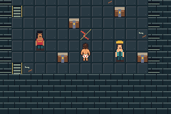
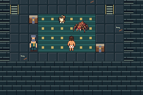
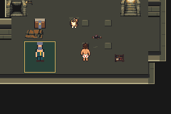

# Overnight visual review

[Open the self-contained review](index.html) after downloading it, or inspect the
actual capture sources below. This is an offline visual document, not a browser
emulator or a public playable release. The private ZIP also includes the verified
production GBA ROM and [build/play instructions](BUILD-AND-PLAY.md).

Tested `eaf073d434a9347dfc2ed921f5f44d163563964b`, merged in PR50 as
`f2edec341fe1a1900f82740cbef25563b08f7532`. All11 comparisons use unedited actual
emulator captures, embedded directly with pixel-preserving display scaling.
[Manifest](manifest.json) records their source files, exact hashes and tested commits.

| Before environment work (f3514ca) | Current (eaf073d) |
|---|---|
|  |  |
|  |  |

The current build has distinct room materials and bounded26-cell geometry changes,
persistent trap/cache/gate/encounter feedback, accurate quest/preparation directions
and one-page repeat recovery. Approved living protagonist/opponent art is preserved.
Full [N05 evidence](../evidence/n05/final/README.md):90 emulator sessions/1531
assertions including193 labeled fixture checks,90 empty errors and38 rendered
comparisons. All six exact recovered-save victories and cold reloads now pass.

Human pacing, static poses/Donut, inherited audio/UI and partial source-kit limits
remain explicit in the review. Prepared continuous and segmented unprepared routes
are separate claims. Stage6 awaits the user's playtest.

Private delivery completed: `DungeonCrawlerCarlemon-N05-eaf073d.zip`,8,135,250 bytes;
SHA256 `34b4e0694a1f78236fa3c7a74d3f0001591d4c845455159dae2b493a69e92826`.
The earlier private review is preserved in version history. Rebuild the package:

```sh
python3 scripts/package-review.py --production-rom /path/to/accepted/production.gba \
  --output artifacts/review/new-review.zip
```

The packager validates the exact ROM, capture bytes, absence of saves/diagnostic
ROMs, archive CRC and every entry hash. It does not upload or publish. The visual
document generator is `scripts/build-visual-review.py`. [Validation](validation.json)
records the separate host HTML-preview limitation after three attempts; no browser
layout acceptance is claimed. Actual emulator images were independently inspected.
